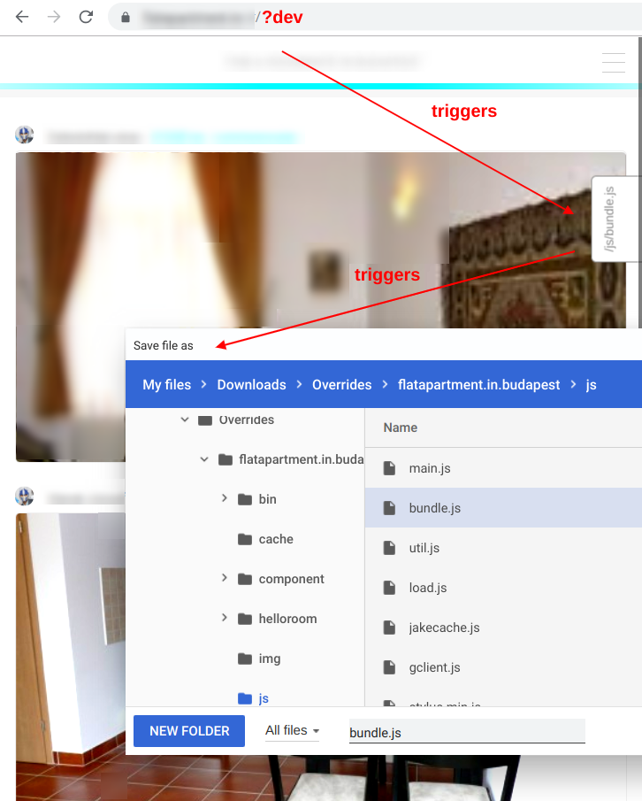

Javascript bundler & code-splitter in the browser #microstack

## Usage

        <html lang="en" manifest="/app.manifest">
          <head>
            
          </head>
          <body>
            

            
          </body>
        </html>

> Now loading index.html will work as usual. Loading `index.html?dev`, will trigger the 
bundler (or type `load.cmd('dev')` in the devtools console).

The second argument (`/js/bundle.js` hints loadjs that it can be bundled, resulting in 
a tab on the right). 
Loading the html-file without the `?flag` (or running `load.cmd('')`) will load the bundled-version instead of the individual files.

## Extending 

Developers can add tabs to trigger other tools, tests or actions like so:

    load.addButton('my tab', () => alert('run test') )

## Why

It's time to reduce clutter (es6 + devtools with builtin webservers are here).
